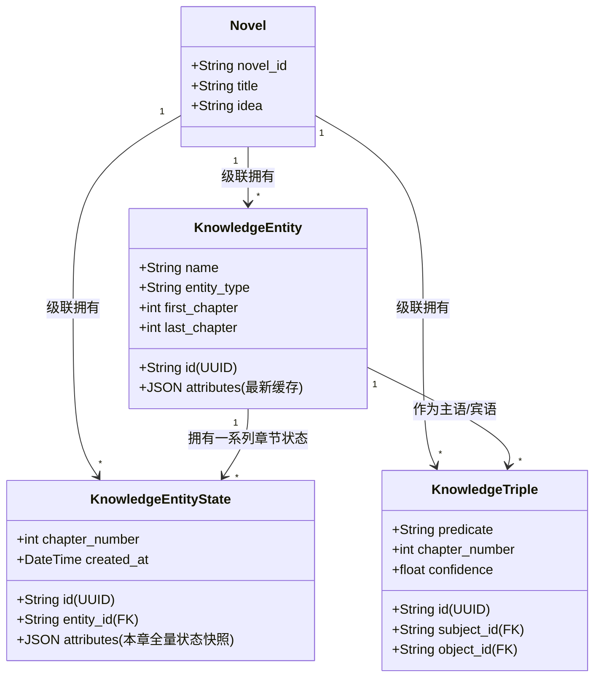

# 阶段 2: 技术设计 - CHANGE-032-live-knowledge-graph

## 1. 架构设计与关系图

升级后的活态知识图谱架构设计如下，为 `KnowledgeEntity` 增加一个章节层面的 `KnowledgeEntityState` 表：



---

## 2. 数据库结构设计

在 `src/api/models/db_models.py` 中新增 `KnowledgeEntityState` 模型，并与 `KnowledgeEntity` 关联：

```python
class KnowledgeEntityState(Base):
    """知识图谱实体状态历史（时空与状态追踪）"""

    __tablename__ = "knowledge_entity_states"

    id: Mapped[str] = mapped_column(String(36), primary_key=True)
    novel_id: Mapped[str] = mapped_column(
        String(100), ForeignKey("novels.novel_id", ondelete="CASCADE"),
        nullable=False, index=True
    )
    entity_id: Mapped[str] = mapped_column(
        String(36), ForeignKey("knowledge_entities.id", ondelete="CASCADE"),
        nullable=False, index=True
    )
    chapter_number: Mapped[int] = mapped_column(Integer, nullable=False, index=True)
    attributes: Mapped[dict] = mapped_column(JSON, default=dict, nullable=False)
    created_at: Mapped[datetime] = mapped_column(
        DateTime(timezone=True), nullable=False, server_default=func.now()
    )
```

**更新已有表关联**：
- `KnowledgeEntity` 增加到 `KnowledgeEntityState` 的关系（可选）：
  ```python
  states: Mapped[list["KnowledgeEntityState"]] = relationship(
      back_populates="entity", cascade="all, delete-orphan"
  )
  ```

---

## 3. 算法与核心流程设计

### 3.1 状态抽取与继承合并算法 (`_merge_entities`)

当知识图谱在抽取第 $N$ 章内容时：
1. **解析实体列表**: 获取 LLM 抽取的实体列表及其当下属性，例如：`{"name": "张三", "attributes": {"health": "injured", "location": "上海"}}`。
2. **计算状态继承**:
   - 如果是已有实体：查询该实体在数据库中 $\text{chapter\_number} < N$ 且最近的一个 `KnowledgeEntityState` 记录；若无，则查询其最初的 `KnowledgeEntity.attributes`。设上一章状态属性为 `prev_attributes`。
   - 如果是全新实体：设上一章状态属性为空字典 `{}`。
3. **覆盖并计算当前全量快照**:
   - `merged_attributes = {**prev_attributes, **extracted_attributes}`。
4. **持久化保存**:
   - 插入一条全新的 `KnowledgeEntityState`（`chapter_number = N`, `attributes = merged_attributes`）。
   - 更新该实体的 `KnowledgeEntity.attributes = merged_attributes`（用于对外提供最新的静态快照兼容性展示）。
   - 更新 `KnowledgeEntity.last_chapter = N`。

### 3.2 记忆相关联上下文检索算法 (`retrieve_context`)

在即将生成第 $M$ 章内容前，输入本章大纲：
1. **关键词发现**: 将大纲转化为字符串，在数据库中匹配出现过的所有 `KnowledgeEntity.name` 或 `aliases`，设结果集合为 $\mathcal{E}$。
2. **最新状态追踪**: 
   - 针对 $\mathcal{E}$ 中的每个实体 $e$：
     - 查询 $e$ 在第 $M$ 章前的最新快照 `KnowledgeEntityState`（即 $\text{chapter\_number} < M$ 且 `chapter_number` 最大的那条记录）。
     - 若没有记录，退而使用 `e.attributes`。
3. **最新双向关系合并与去重**:
   - 针对 $\mathcal{E}$ 中的所有实体 $e_i$：
     - 查询所有 `KnowledgeTriple` 满足 $\text{chapter\_number} < M$ 且 `status == "active"`，且 `subject_id` 或 `object_id` 属于 $\mathcal{E}$。
     - 按 `chapter_number` 降序对关系去重。每个 `(subject, predicate, object)` 对，只保留最新的变迁历史。
4. **大纲性格/特征关联**:
   - 同时从 `Character` 数据库表中通过 `name` 字段加载其正式设定（`personality`, `abilities`, `background_story`）。
5. **记忆区域格式化**:
   - 构建结构化的 Markdown 上下文（详见“需求分析”中的 Prompt 设计）。
   - 注入到下一章生成的 System Prompt 最顶层。

---

## 4. API 接口设计

### 新增 API: 查询实体在小说章节间的历史轨迹

`GET /api/v1/projects/{novel_id}/knowledge-graph/entities/{entity_id}/history`

**响应格式** (JSON):
```json
[
  {
    "chapter_number": 5,
    "attributes": {
      "status": "healthy",
      "location": "北京"
    },
    "created_at": "2026-05-20T09:30:00Z"
  },
  {
    "chapter_number": 20,
    "attributes": {
      "status": "injured",
      "location": "上海"
    },
    "created_at": "2026-05-20T09:45:00Z"
  }
]
```

---

## 5. 质量门禁 (Gate 1 确认)

技术设计现已全部就绪。为了启动 Harnessflow 的阶段 3 编码与测试，我们需要：
1. 将本设计呈现给用户。
2. 获得人工审核通过（在变更目录下创建 `.gate1-approved` 标志）。
